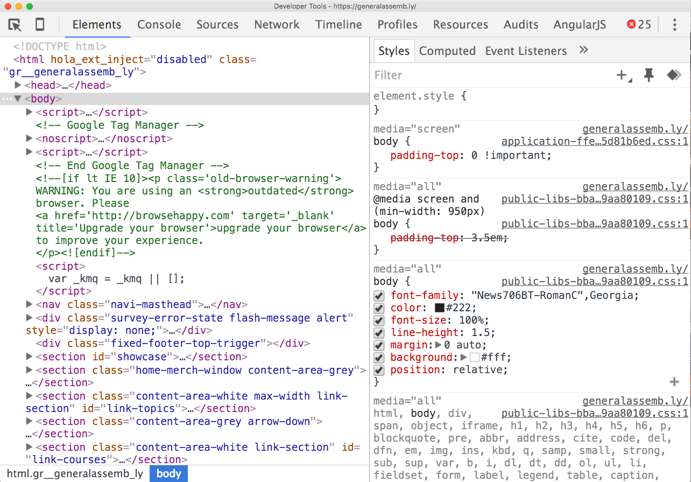
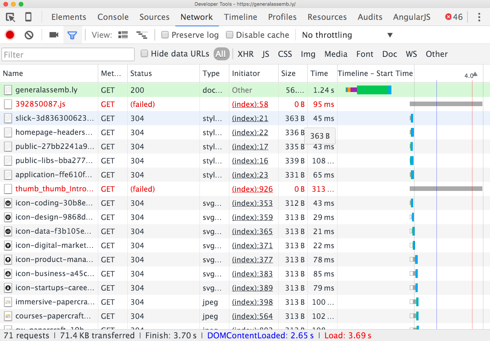

# Chrome Dev Tools

### Objectives
*After this lesson, students will be able to:*

- Open and describe the components of the Chrome developer tools
- Use the developer tools to manipulate page elements (HTML/CSS)

### Preparation
*Before this lesson, students should already be able to:*

- Use Chrome
- Write basic HTML
- Write basic JavaScript

## What are Dev Tools? – Intro (3 mins)

Most modern browsers include a set of tools that allow developers to monitor and explore what's going on in a web page. The Chrome Developer Tools, which are often called the "Dev Tools", are essential knowledge for every web developer.

We can do a lot of useful things with these tools, but some of the things that are most useful:

- We can view the HTML & CSS as the browser has understood them
- We can watch requests and responses as they are made and received
- We can observe JavaScript being run
- We can debug issues with our code
- We can issue JavaScript commands on a console, or browser command line

Having such a powerful set of browser tools at our disposal is incredibly valuable, and you should get into the habit of using them to their full potential.

## Open the DevTools – Demo (10 mins)

First, let's navigate to [http://generalassemb.ly](http://generalassemb.ly).

Now to access the DevTools, we can press:

- `⌘ + ⌥ + i` to open the DevTools (to the most recent tab used)

If you forget this command, you can go to *View > Developer > Developer Tools* or right click on the page and select *Inspect*, but try to memorize the keyboard shortcut.

#### DevTools Tabs

Overall, there are eight main tools available in the Developer Tools. You may see people with a few more as you can add custom ones using extensions.

- [**Elements**](https://developer.chrome.com/devtools/docs/dom-and-styles): Inspect and edit the HTML & CSS of the DOM (Document Object Model)
- [**Console**](https://developer.chrome.com/devtools/docs/console): Run JavaScript in the browser
- [**Network**](https://developer.chrome.com/devtools/docs/network): Evaluate network performance (refresh to see it in action)
- [**Resources**](https://developer.chrome.com/devtools/docs/resource-panel): Manage application storage
- **Sources**: A graphical interface to the V8 debugger
- [**Timeline**](https://developer.chrome.com/devtools/docs/timeline): Evaluate page load performance (refresh to see it in action)
- [**Profiles**](https://developer.chrome.com/devtools/docs/profiles): Identify optimizations in the performance of an app or webpage.
- **Audits**: The Audit panel can analyze a page as it loads.

The key ones to focus on are:

- **Elements**
- **Console**
- **Network**

## Elements Tab (10m)



Inspect and edit the HTML & CSS of the [Document Object Model](https://developer.mozilla.org/en-US/docs/Web/API/Document_Object_Model/Introduction), which is structured like a [tree](https://en.wikipedia.org/wiki/Tree_(data_structure)). In this view we can see a representation of the DOM as interpreted by the browser.

**Selecting**

Target a specific element to inspect or edit:

- In the top-left corner of the elements tab there is an icon that looks like a mouse pointer inside of a box—click on it and then click any element you want to inspect.

    *or*

- Right-click any element you want to inspect and then click the option "Inspect" in the menu

**Inspecting**

*Note: The `elements` tab has additional tabs. We will use the `styles` tab to edit, but now we will use the `computed` tab to inspect.*

Inspect the styles applied to an element:

* See the styles for any page or element *exactly* as the browser has interpreted all of the CSS styles collectively.

* Access a visual representation of the box model along with a set of the computed values.
    * Since CSS loads styles sequentially, it's possible for a rule in one stylesheet to be overwritten by another that was loaded subsequently.


**Editing**

Delete elements:

- Select an element in the elements tab, such as the `body`, and delete it by pressing the `Delete` button, and then undo it by pressing `⌘ + z`

Copy & paste elements:

- Copy & paste elements with `⌘ + c` & `⌘ + v`

Change text:

- Select an element that contains text in the elements tab, and double click the text inside of it to edit; when you click back outside of the element the changes will reflect on the page

Change values:

- Use up/down arrow to increment/decrement any value by one (try it with font-size or padding)
- Use `⌥ + ↑` or `⌥ + ↓` to increment/decrement by 0.1
- Use `SHIFT + ↑` or `SHIFT + ↓`to increment/decrement by 10

Anything else:

- Edit the raw HTML content by *right-clicking* and choosing "Edit as HTML" (clicking outside of the text-edit box will save the changes, while using the `esc` key will erase them).


**Styling**

Choose the perfect color:

- Notice that as you start defining a CSS `property` such as `background` with a `value` such as `red` the browser will try to autocomplete
    - If Chrome recognized the color you typed, you will also see a colored box appear next to the color `value`
- Press `SHIFT` and click on the colored box to toggle through color format: rgb, hex, hsl, etc
- Click on the colored box to choose a more specific color
- Click onto the page to see a color selector and grab a color already on the page

## Exercise: 15 Minutes of Fame (10m)

For modifying and editing your HTML & CSS, the dev tools has made it super easy to quickly test and edit these changes before incorporating them into your application. On the [New York Times](http://www.nytimes.com/) complete the following challenges.

Using the tips above, change:

* the lead headline to "Anonymous and WDI Take Down North Korea"
* the lead photo to a picture the happiest kitten you can find
* the `body`'s background to your favorite color
* Add a `margin-top` of 10px to the `main` element (that also has `id` and `class` `main`) and increment it up to 20px using the arrow keys

The goal is get you comfortable editing and manipulating the DOM. This skill will be essential in every one of your projects.

## Network Tab (10m)



The Network panel records information about each network operation in your application, including detailed timing data, HTTP request and response headers, cookies, WebSocket data, and more.

- Refresh the page and have a look at the requests being made by the page
  - Notice that the status of a lot of the resources are **304** (not modified)
- Momentarily check 'Disable Cache' so the requests are processed as new each time we ask for a resource from the server
  - Refresh the page, and you should see that everything is now **200** (ok)

#### Meaning of HTTP Status Codes

* 1xx — Informational
* 2xx — Success
* 3xx — Redirection
* 4xx — Client Error
* 5xx — Server Error

For more information on status codes you can reference [HTTP Cat](https://http.cat/)

#### Filtering

By default, the network Tab shows all requests being made. However, you can filter these requests by:

- All
- XHR (aka AJAX)
- Script
- Style
- Images
- Media
- Fonts
- Documents
- WebSockets
- Other

You can also search through these requests, which can be useful.

#### Sending Requests

You can send off an HTTP request directly from the terminal. Try requesting a webpage or downloading a file using the `curl` command (the name originated from "see URL").

request content: `curl www.example.com`

download content: `curl -O <link-to-some-file>` (try an image)


## Console Tab (10 mins)

Lastly, let's have a look at the console tab (you can use the shortcut – `⌘ + ⌥ + j` to navigate directly to it).

The JavaScript Console provides two primary functions for developers testing web pages and applications. It is a place to:

- Write JavaScript that interacts with the DOM and browser
- Log diagnostic information in the development process using the [Console API](https://developer.chrome.com/devtools/docs/console-api)


When we write JavaScript that we intend to be processed in a browser, we can use commands like `console.log()` to log values from our Javascript straight to this tab, as the code executes. It's the next best thing to setting a breakpoint when we're debugging; we'll talk about this strategy later in the debugging lesson.  

#### Console Shell

The console shell also allows us to execute Javascript and interact with the DOM using Javascript, just like we would from a JavaScript file that we load with the page.

Let's try this:

```
> var a = 1;
> var b = 1;
< undefined

> a + b
< 2
```

## Independent Practice (20 mins)

Take a look at this screenshot:


Using the Chrome dev tools, try to recreate this screenshot on [Google.com](http://www.google.com).

No pressure, this is meant to be exploratory!  So you'll have to dig through some HTML elements and their CSS to make this work.  For example, you'll have to modify the `float` property of the image in the search bar—something we haven't touched on yet.

Keep in mind if you refresh the page you **will** loose all your work.

The General Assembly large logo can be sourced from the [General Assembly homepage](https://generalassemb.ly/) and the smaller logo, in the search bar, will have to be found through Google.  
Remember, don't refresh the page, otherwise you'll lose all your work modifying the DOM.  

## Bonus Material

* Learn more about the [DOM](https://developer.mozilla.org/en-US/docs/Web/API/Document_Object_Model/Introduction)
* Memorize the dev tool [keyboard shortcuts](https://developer.chrome.com/devtools/docs/shortcuts)
* Explore the [Window API](https://developer.mozilla.org/en-US/docs/Web/API/Window); the window object represents a window containing the DOM.