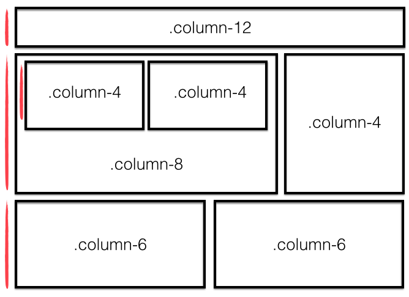

#Bootstrap
###Learning Objectives

* Require Bootstrap into your project
* Understand and implement a grid system
* Design HTML pages with the aid of Bootstrap & mockups

##Intro to Bootstrap

* [Bootstrap](http://getbootstrap.com/) is a **front-end framework** created by a small team of developers at Twitter and maintained by a much larger community of contributors.
* The framework consists of one main CSS file, an optional theme CSS file, and a main JS file.
* Bootstrap requires [jQuery](https://code.jquery.com/) to work, which is a JavaScript library.

Bootstrap is extremely popular and knowledge of at least one CSS framework is a very valuable skill to have (and totally worth putting on your resume). 

Bootstrap comes with a ton of features, including:

- Reponsive Grid System
- CSS library for quick and easy styling
- UI components - HTML + CSS 
  - navigation
  - buttons
  - forms
  - etc.
- Javascript widgets to make your page interactive
- Tons more


##Including Bootstrap with HTML
* To use Bootstrap, we need to include Bootstrap's CSS and Javascript libraries (+ or - an optional Bootstrap-Theme CSS file).
* We also need to inclue jQuery, as Bootstrap's JS plug-ins depend on it.  
* There are a few different ways to accomplish this, listed below. In this class, we'll keep it simple and stick with the CDN.

1. CDN (Content Delivery Network - someone else hosts the library/framework and you access it via a URL):  [http://getbootstrap.com/getting-started/#download-cdn](http://getbootstrap.com/getting-started/#download-cdn). Where do we include these in our HTML file?
2. Download the actual CSS and JS files and link to them on your local computer - better for offline/local development

##What is Responsive Design?

"Responsive web design (RWD) is an approach to web design aimed at crafting sites to provide an optimal viewing and interaction experience— easy reading and navigation with a minimum of resizing, panning, and scrolling—across a wide range of devices (from desktop computer monitors to laptops to cellphones).

A site designed with RWD adapts the layout to the viewing environment by using fluid, proportion-based grids, flexible images, etc..."

Source: [Wikipedia](https://en.wikipedia.org/wiki/Responsive_web_design)


##Responsive Grid System (aka Columns of Craziness)
* Columns are written in the following format as a class attribute: `col-(breakpoint)-(offset)`
* For example: `col-sm-4`
* Columns are often wrapped into an element with a class of `row` or `container`.

####Start with a container
To ensure all your Bootstrap styles behave properly, always put your content inside an element with a class "container" (usually `<div class="container">`). This will center your content and leave a small margin on the sides of the page. If you would like to use the full width of the screen (no margin) use `class="container-fluid"`

####Page layout using the Grid System


Bootstrap's grid system is based on the idea that a page layout for any given screen size is represented with 12 fluid **columns**.  Columns are always horizontally contained in **rows**, which in turn are contained inside of the previously mentioned `container` (container > row > column):

1. Create a row: 

  ``` html
   <div class="row"> ... </div>
  ```
  
2. Inside your row, create a column for the targeted screen size: 
  - col-xs < 768px (e.g. smartphones)
  - col-sm ≥ 992px (e.g. tablets)
  - col-md ≥ 1200px (e.g. laptops, desktops)
  - col-lg ≥ 1200px (e.g. large desktops, smart TVs)

Here's an example of a two-column layout that spans the width of the page.  Notice that the widths of the two columns add up to 12.  The column content of any row must always be ≤12.

``` html
 <div class="row">
   <div class="col-md-6">
     <p>I'm a medium-sized column</p>
    </div>
   <div class="col-md-6">
     <p>Me too! We have SO much in common</p>
   </div>
 </div>
```

For other examples, check out the [Bootstrap docs](http://getbootstrap.com/css/#grid)  

##Breakpoints
* The way that Bootstrap works is to dynamically reduce column size according to the window size.
* To be mobile (and tablet!) -friendly, the columns will break into a stack layout after a minimum width is detected.
* The breakpoints you can select in your columns control at which point this happens.
* Check out their [documentation](http://getbootstrap.com/css/#grid) here to see what these breakpoints are in terms of size.
* Let's test it!


You can also offset and nest your columns. When you offset a column, you add a column of whitespace and push the column to the right.  Example:

``` html
 <div class="row">
   <div class="col-md-3 col-md-offset-3">
     <p>This column occupies 1/4 of the page width and is moved to the right 
     by 1/4 of the page width</p>
   </div>
 </div>
```
Here is an example of nesting columns (putting one row inside another)

``` html
 <div class="row">
   <div class="col-md-6">
     Level 1: Column takes 1/2 the width of the page
     <div class="row">
       <div class="col-md-4">
         Level 2: This column takes 1/3 the width of its parent column
       </div>
       <div class="col-md-8">
         Level 2: This column takes 2/3 the width of its parent column
       </div>
     </div>
   </div>
 </div>
```

What would this actually look like?  Demo


####Typography
For a complete list: [Bootstrap Typography classes](http://getbootstrap.com/css/#type)

To align text, use these classes.  

``` html
 <p class="text-left">Left aligned text.</p>
 <p class="text-center">Center aligned text.</p>
 <p class="text-right">Right aligned text.</p>
 <p class="text-justify">Justified text.</p>
 <p class="text-nowrap">No wrap text.</p>
```
More useful typography classes...

``` html
 <p class="lead">This text will stand out in a paragraph</p>
 <small>This line of text is meant to be treated as fine print.</small>
 <p class="text-lowercase">Lowercased text.</p>
 <p class="text-uppercase">Uppercased text.</p>
 <p class="text-capitalize">Capitalized text.</p>
```


####Icons
Bootstrap comes with a set of icons that can be included in your page using the `<i></i>` tag. Check out these icons [here](http://getbootstrap.com/components/#glyphicons)

####Buttons
Bootstrap provides a wide selection of button sizes and colors.  Button classes can be applied not just to `<button>` elements, but also `<a>` and `<input>` elements

Sometimes you need to provide multiple classes to an element in order for Bootstrap to style it.  The button classes are an example of this:

``` html
 <!-- Standard button -->
 <button type="button" class="btn btn-default">Default</button>
 
 <!-- Provides extra visual weight and identifies the primary action in a set of buttons -->
 <button type="button" class="btn btn-primary">Primary</button>
 
 <!-- Contextual button for informational alert messages -->
 <button type="button" class="btn btn-info">Info</button>

 <!-- Indicates caution should be taken with this action -->
 <button type="button" class="btn btn-warning">Warning</button>
```  
... and so on.  See the [docs](http://getbootstrap.com/css/#buttons) for a comprehensive list of options.  Note you can add a third class denoting size to any of the above: `.btn-lg`, `.btn-sm`, `.btn-xs`


####Images 
Bootstrap helps you format images using `class="img-rounded"` (rounds the corners), `class="img-circle"` (makes the image a circle) and `class="img-thumbnail"` (adds a border). You can also add a `class="img-responsive"` to your image to make it scale well when the screen size changes (this sets its max-width to 100% of its parent element and the height to auto for maintaining aspect)

####Forms
Bootstrap is also very helpful when you need to style your forms. All textual `<input>`, `<textarea>`, and `<select>` elements with `class="form-control"` are set to width: 100% by default. Wrap labels and their associated controls (inputs) in `class="form-group"` for optimum spacing. 
 

####Javascript plug-ins
Bootstrap allows you to incorporate interactive behavior into your page with Javascript plug-ins.  While you would ultimately have to write some JS in order for these components to provide actual functionality within the application, you don't have to write JS if you're simply mocking up a UI.

Some examples:

- [Responsive Nav bars](http://getbootstrap.com/components/#navbar)
- [Dropdowns](http://getbootstrap.com/javascript/#dropdowns)
- [Popovers](http://getbootstrap.com/javascript/#popovers)
- [Modals](http://getbootstrap.com/javascript/#modals)
- [Carousels](http://getbootstrap.com/javascript/#carousel)

Always make sure you understand what the code is doing before copying and pasting it. Fortunately, this is not too challenging and Bootstrap has excellent documentation. As always, if you're confused or things are breaking - google around. Bootstrap is pretty much ubiquitous and it is likely that others have encountered and (hopefully) solved the issues you're dealing with.