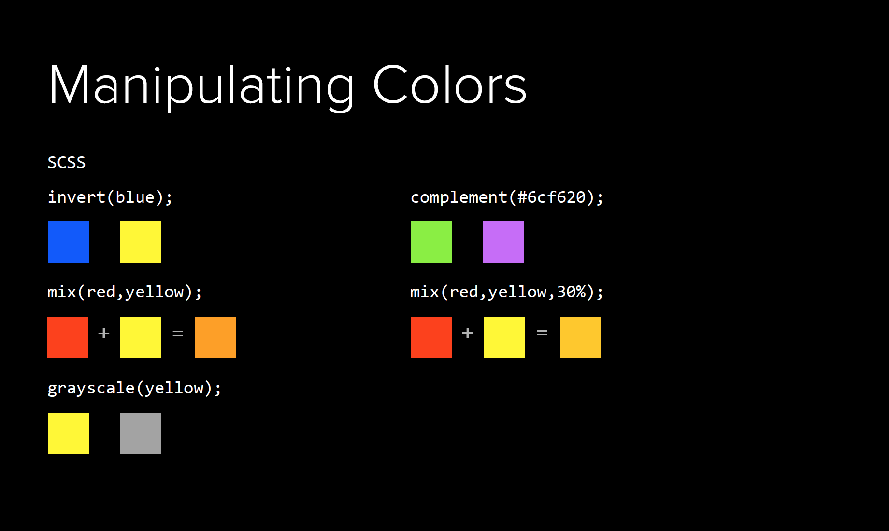
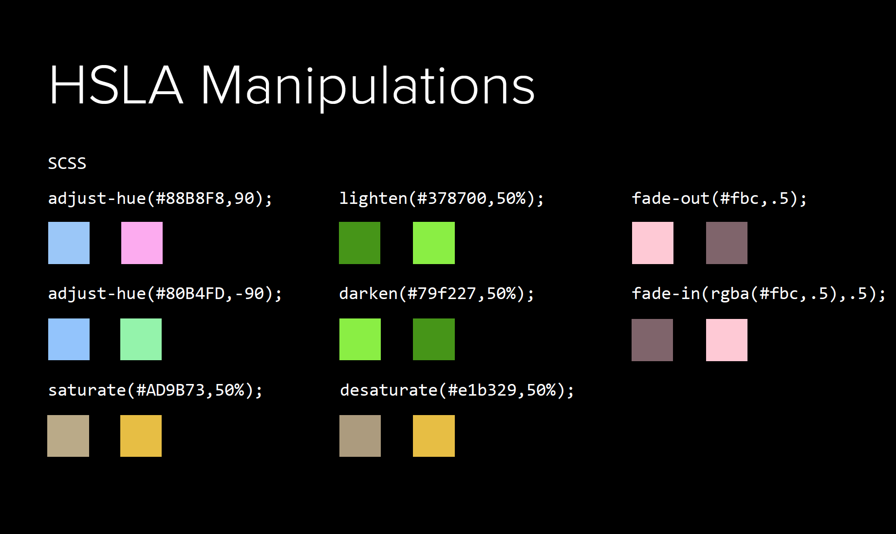

# Preprocessing CSS with Sass

## What is Sass?
- Syntactically Awesome Style Sheets
- Pre-processor for CSS, making it easier to manage CSS
- Adds the power of math, variables, logic and more
- 2 syntaxes available (.sass and .scss with Compass)
- Makes writing CSS funner!

## Install Sass

To begin, we need to `cd` into the directory where we want to work:

``` bash
cd [PATH_TO_DEV]/

```

There are many different ways to install Sass. In this class we've already learned a bit about Bootstrap and we haven't looked at Ruby yet, so we're going to use bower to install.

Bower is a package manager that will help us install Sass with Bootstrap. It's a good idea to run this command even if you already have Bower, because this will update your code to the latest version.

``` bash
npm install -g bower

```

Now we can use `bower` to install bootstrap-sass.

``` bash
bower install bootstrap-sass

```

This will create a `bower_components` directory with a bunch of contents in it, including jquery and bootstrap.

### Make your index.html

This is basically the bootstrap-snippets HTML5 template, with a few important adjustments:

``` html
<!DOCTYPE html>
<html lang="en">
    <head>
        <meta charset="utf-8">
        <meta http-equiv="X-UA-Compatible" content="IE=edge">
        <meta name="viewport" content="width=device-width, initial-scale=1">
        <title>Title Page</title>

        <!-- Custom CSS -->
        <link href="bootstrap-sass/assets/stylesheets/app.css" rel="stylesheet">
        
    </head>
    <body>
        <h1 class="text-center">Hello World</h1>

        <!-- jQuery -->
        <script src="jquery/jquery.min.js"></script>
        <!-- Bootstrap JavaScript -->
        <script src="bootstrap-sass/assets/javascripts/bootstrap.min.js"></script>
    </body>
</html>

```

_This won't look like much yet if you run it in the browser._

### Create your .scss file and your .css file

``` bash

cd bower_components/bootstrap-sass/assets/stylesheets

touch stylesheets/app.scss
touch stylesheets/app.css

```

### Compiling SCSS to CSS

``` bash
sass --watch app.scss:app.css

>>> Sass is watching for changes. Press Ctrl-C to stop.

```

If this runs with no errors you can see the Bootstrap CSS written in app.css. Refresh your index.html to confirm the centered text and font.

Now let's learn and play. _NOTE: The examples below You will need to figure out how to refactor them with Bootstrap classes and then add the necessary HTML to make these examples do anything useful._

## What makes up Sass?

- Nesting
- Variables
- Mixins
- Functions
- @extend
- Math
- Color Functions
- @import

## Nesting
- Makes style sheets more readable
- No longer rewrite selectors over and over again
- Be careful not to over-nest

#### Example 1. Sass Basic Nesting:
``` css
.class-name {
    background-color: #eee;
    h1 {
        font-size: 1.4em;
        color: #333;
        a {
            color: #02f; 
            text-decoration: underline;
        }
    }
}
```

####  Example 1. CSS:


``` css
.class-name {
    background-color: #eee;
}

.class-name h1 {
    font-size: 1.4em;
    color: #333;
}

.class-name h1 a {
    color: #02f;
    text-decoration: underline;
}

```

#### Example 2. Sass Nesting with Symbol Selectors:
``` css
.class-name {
    > h2 {
        line-height: 1.5em;
    }
    + h4 {
        padding: .5em;
    }
    * {
    color: #01f;
    }
}

```

#### Example 2. CSS
``` css
.class-name > h2 {
    line-height: 1.5em;
}

.class-name + h4 {
    padding: .5em;
}

.class-name * {
    color: #01f;
}

```

#### Example 3. Sass Nesting with Parent Selector `&`
``` css
a {
    color: #01f;
    display: block;
    &:hover {
        color: #051;
    }
    .callout & {
        color: #f00;
    }
}

```


#### Example 3. CSS
``` css
a {
    color: #01f;
    display: block;
}

a:hover {
    color: #051;
}

.callout a {
    color: #f00;
}

```

#### Example 4. Sass @media Bubbling

``` css
header {
    margin: 24px;
    @media only screen and (min-width: 768px) {
        margin: 20px;
    }
}

```

#### Example 4. CSS
``` css
header {
    margin: 24px;
}

@media only screen and (min-width: 768px) {
    header {
        margin: 20px;
    }
}

```

## Variables
- Make code easier to change because they reduce duplication
- Name things by their intent and be more semantic
- Simple examples seem to take more code, but they become more valuable with more code

``` css
/* Sass Variables syntax: */

$my-variable: value;

```

#### Example 5.  Sass Basic Variable Usage
``` css
$main-color: #1d96bc;
a {
    color: $main-color;
}

```

#### Example 5. CSS
``` css
a {
    color: #1d96bc;
}

```

#### Example 6.  Sass Variable as Variable
``` css
$blue: #1d96bc;
$main-color: $blue;

h1 {
color: $main-color;
}

```

#### Example 6. CSS
``` css
a {
    color: #1d96bc;
}

```

#### Example 7. Sass Text String Variable
``` css
$font-stack: "Helvetica Neue", Helvetica, Arial, sans-serif;

body {
    font-family: $font-stack;
}

```

#### Example 7. CSS
``` css
body {
    font-family: "Helvetica Neue", Helvetica, Arial, sans-serif;
}

```


#### Example 8. Sass Variable Interpolation Braces  `#{  }` 
``` css
$small: "only screen and (max-width: 768px)";

@media #{$small} { 
    a {
        font-size: 16px;
    }
}

```

#### Example 8. CSS
``` css
@media only screen and (max-width: 768px) {
    a {
        fonx-size: 16px;
    }
}

```

## Mixins
- The equivalent of Macros from other programming languages
- Generates code at compile
- Can use logic

``` css
/* Sass Mixin Syntax: */

@mixin mixin-name($option) {
    /* ...css code... */
}

a {
    @include mixin-name;
}

```

#### Example 9. Sass Mixins Basic Usage
``` css
@mixin border-radius($radius) {
    -webkit-border-radius: $radius;
    -moz-border-radius: $radius;
    -ms-border-radius: $radius;
    border-radius: $radius;
}

.button {
    background: black;
    color: white;
    padding: 10px 20px;
    @include border-radius(5px);
}

```

#### Example 9. CSS
``` css
.button {
    background: black;
    color: white;
    padding: 10px 20px;
    -webkit-border-radius: 5px;
    -moz-border-radius: 5px;
    -ms-border-radius: 5px;
    border-radius: 5px;
}

```

#### Example 10. Sass Mixins with Multiple Options
``` css
@mixin btn($bg:#f00, $pad:10px) {
    background: $bg;
    padding: $pad;
    font-size: $pad - 2px;
}

.button {
    @include btn(#00f,20px);
}

```

#### Example 10. CSS
``` css
.button {
    background: #00f;
    padding: 20px;
    font-size: 18px;
}

```

#### Example 11. Using 'Sassy' Logic with Mixins

``` css
@mixin btn($bg) {
    $bg-lightness: lightness($bg);
    background-color: $bg;

    @if $bg-lightness > 70% { color: #333333; } 
    @else { color: #ffffff; }
}

.button {
    @include btn(#0000ff);
}
.button-alt {
    @include btn(#dddddd);
}

```

#### Example 11. CSS
``` css
.button {
    background-color: blue;
    color: #ffffff;
}

.button-alt {
    background-color: #dddddd;
    color: #333333;
}

```


## Functions

- Instead of outputting code, they output value
- Reusable logic
- Great for calculating things, like grid percentages

``` css
/* Sass Function Syntax */
@function name($num,$num2) {
    @return $num + $num2
}

.my-module {
    padding: name($num,$num2);
}

```

#### Example 12. Basic Sass Function
``` css
$em-base: 16px;

@function emCalc($px-width) {
    @return $px-width / $em-base * 1em;
}

h1 {
    font-size: emCalc(14px);
}

```

#### Example 12. CSS
``` css
h1 {
    font-size: .875em;
}

```

#### Example 13. Sass Function with Multiple Inputs
``` css
@function grid-calc($col,$total-col) {
    @return percentage($col/$total-col);
}

@function gc($col,$total-col) {
    @return grid-calc($col,$total-col);
}

.panel {
    width:gc(3,12);
}


```

#### Example 13. CSS
``` css
.panel {
    width: 25%;
}

```


## @extend
- A powerful means of class inheritance
- Reduces code bloat that mixins can create
- Uses the cascade instead of works around it
- They should do one thing, and do it well

``` css
/*  @extend Syntax:  */

%placeholder {
    // Styles
}

.class { @extend %placeholder; }
.class2 {
    @extend %placeholder;
    // Unique styles
}

```

#### Example 14. Sass @extend Basic Usage
``` css
%clear-fix {
    *zoom:1; 
    &:before, &:after {
    content: " ";
    display: table;
    }
    &:after { clear: both; }
}

.row {
    @extend %clear-fix;
}
.hero {
    @extend %clear-fix;
    color: #f00;
}

```

#### Example 14. CSS
``` css
.row, .hero {
    *zoom:1;
}

.row:before, .row:after, 
.hero:before, .hero:after {
    content: " ";
    display: table;
}

.row:after, .hero:after {
    clear: both;
}

.hero {
    color: #f00;
}

```

## Sassy Math
- Power and control over the value in your CSS
- Make relationships easier
- Use with the power of Variables and built-in functions

``` css
/* Sass Math Operators: */
1px + 1px               /* 2px  */
10em - 2em              /* 8em  */
6px * 4                 /* 24px */
100 / 10                /* 10   */
18 % 5                  /* 3    */

((10 * 2) / 5) + 4px    /* 8px  */

```

#### Example 15. Math & Variables in Sass

```css
$page: 960px;
$main: 680px;
$gutter: 30px;

#sidebar {
    width: $page - $main - $gutter;
}

```

#### Example 15. CSS
``` css
#sidebar {
    width: 250px;
}

```

#### Example 16. Math Functions in Sass
``` css
percentage(13/25)   /* 52% */
round(2.4)          /* 2   */
ceil(2.2)           /* 3   */
floor(2.6)          /* 2   */
abs(-24)            /* 24  */

```

## Color Functions in Sass


#### Example 17. RGBA Function
```css
p {
    color: rgba(blue, .75);
}

body a {
    color: rgba(#ffa, .25);
}

```

#### Example 17. CSS
``` css
p {
    color: rgba(0,51,255,0.75);
}

body a {
    color: rgba(255,255,170,0.25);
}

```






## @import
- Separate stylesheets by type, components, etc.
- Keep CSS organized
- Compiles into a single stylesheet

``` css
@import “stylesheet”;
@import “stylesheet2”;
@import “stylesheet3”;

```

``` bash
parts/
    _global.scss
    _buttons.scss
    _forms.scss
    _grid.scss
    _mobile.scss
    _orbit.scss
    _reveal.scss
    _type.scss
    _ui.scss

app.scss
```

``` css
/* app.scss */

@import "parts/global";
@import "parts/buttons";
@import "parts/forms";
@import "parts/grids";
@import "parts/mobile";
@import "parts/orbit";
@import "parts/reveal";
@import "parts/type";
@import "parts/ui";

```


