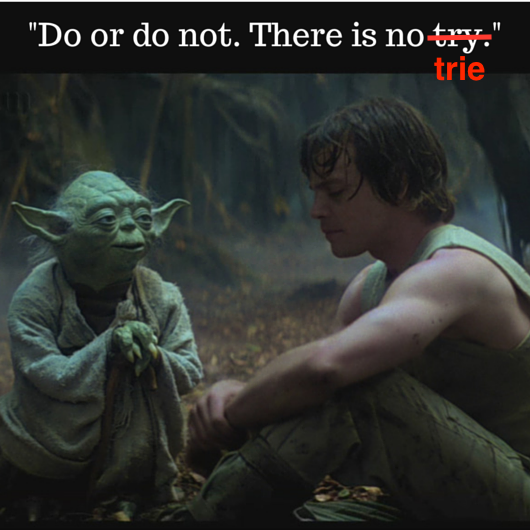

#The Trie of Life!

##Deep thoughts...

How do you think Google's autocomplete feature works?

##Give it a Trie...
A Trie is a specific form of a tree used to re**trie**ve data. Using it we can search and store Strings in an extremely efficient manner. Words are grouped according to shared spelling (apple and app share a-p-p, beethoven and beech share b-e-e) and *we are able to store multiple words using less repeated letters*.

The Trie structure resembles a tree, in that there is a `root` (beginning) that branches & branches & branches out to leaves (end.) Each branch or node is a `child` of the node above it.  Appropriately, each node that has a `child` is called a `parent`.  The root node has no parent. Leaf nodes have no children.


>A simple Trie diagram that stores the following words: ace, aced, aces, acre, acres, act, acted, acting, & acts. The greyed out nodes represent the completion of a valid word.

Storing words in this manner makes searching for strings extremely fast; the worst case scenario for finding the word is the word's length.

Some Tries also 'smoosh' their words together when they only have one `child` node. Imagine the diagram above, only with a single element with the letters `ing` below `t` for the word *acting*.

Notice the node `c` has three children and the Node `t`, below, also has three children. How would you store those children in an orderly manner?

##Challenge: Trie your best!




Let's spend the first day trying to handroll our own trie data structure.  For a gentle start, we will attempt to create a Trie that will store the words from above:

```javascript
['ace', 'aces', 'aced', 'acre', 'acres', 'act', 'acted', 'acting', 'acts']
```

**Considerations**
- What would a node object have inside it? Surely it would least have a single letter.  
- How would you store any and all of the children?  
- How would you know when you have found a valid word? (Hint: don't forget that ace is inside aced and act is in acting)

How would you impliment, in pseudocode, the following:
- A node object that contains:
	-  a single character (a-z only)
	-  an indication whether or not the node is the last letter in a valid word
	-  the necessary internal data structures to hold all possible children nodes (ponder this...)
- A Trie object with the prototypical method:
	- `#add(word)` that integrates a new word into the Trie, using a node for each letter

**Suggested Implementation:** Talk out how you would go about adding a single word into a fresh and empty Trie.  Talk out how you would add a second word similar in spelling to the first word, such as `rockslide` & `rocknroll`.

**Solution** Checkout `solution-code` for an example real-life implementation. Take some time to digest it.
