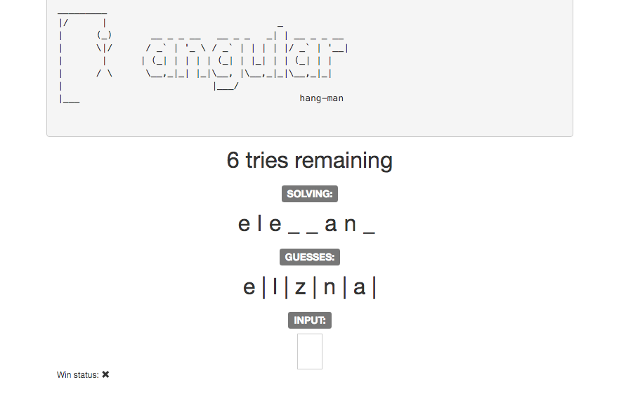

<pre>
_________
|/      |                               _
|      (_)       __ _ _ __   __ _ _   _| | __ _ _ __
|      \|/      / _` | '_ \ / _` | | | | |/ _` | '__|
|       |      | (_| | | | | (_| | |_| | | (_| | |
|      / \      \__,_|_| |_|\__, |\__,_|_|\__,_|_|
|                           |___/
|___                                        hang-man
</pre>

## Learning Objectives

This lab is a chance to use the skills you've developed so far and play with angular.
You'll be making an in-browser [hang-man game](https://en.wikipedia.org/wiki/Hangman_(game)). By the end of this lesson you should be able to:

* Build a working object oriented hangman game using concepts we've already covered such as
    * `ng-model` to get use input
    * `ng-controller` to organize your code
    * `ng-repeat` to visualize a collection
    * `ng-change` to fire an event

## Mockup of End Result



## Setup

1. clone this repo (or fork & clone)
1. open index.html and app.js
1. open hangman.js and read it's contents

Most of the game code itself has been given to you.  Let's check it out using dev tools.
Open index.html and in the browser console try the following:

```js
hangman = new HangmanGame('test');
```
You should have a new instance of a game. Now try running:

```js
hangman.guess('x');
hangman.guess('t');
hangman.checkGameWinStatus();
```

Note what is returned, and what changes on `hangman`.  You'll use this inside your angular controller.


### Step 1: Initialization
Let's get angular setup in our app.  

* `bower install` your front-end assets
* add `ng-app` in the appropriate location and set it equal to your "hangmanApp"
* register a new controller with your application called "hangmanCtrl" and use it in the view

### Step 2: Game Properties

* in the controller instantiate a new game instance, `new HangmanGame('elephant')`, and pass it to the view
* a `HangmanGame` instance provides `guesses`, `completedWord` and `triesRemaining` properties.
Add these in the appropriate parts of the html using expressions to get the values from the hangmanGame to display on the page.
  * Hint: You might not be able to see the guesses until you make some.  We don't have
  an interface for that yet, but we can add a couple of guesses right in the controller. You can try calling `.guess('f')` on your game instance inside the controller.  `console.log as needed`.
  * Note: `completedWord` is a string containing guessed characters that match, in their
    correct positions.  E.g. if you guessed 'b' and 'r' for 'rabbit', it shows: 'r_bb__'


### Step 3: User Input

* autofocus to the input field
* use `ng-model` to track the input field's value
* use `ng-change` to call a function when the input changes and pass in the input's value
  * write a helper function in your controller for this
  * for now you can just console.log the value of the input
    * make sure to make the function publicly available on a controller instance
      * e.g. `this.checkGuess = yourFunctionName`
  * the input should be cleared after each character is typed

### Step 4: Win State

* add the class "glyphicon-ok" to the span with class "glyphicon" if the game is won
* add the class "glyphicon-remove" to the span with class "glyphicon" if the game is lost

### Step 5: Looking Good

That array on the page is kinda ugly.  Let's fix it.

* change the array to display using `ng-repeat`
* improve the looks of anything else as desired

### Step 6: More User Stories

Accomplish the following features on your own or in a pair. User can...

* enter an uppercase word that's treated as a lower case word
* be challenged with a random word from a list of words
* restart the game after win/lose
* keep score of games won and lost
* see a drawing of the hangman as the game progresses

